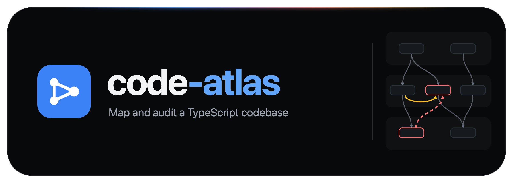
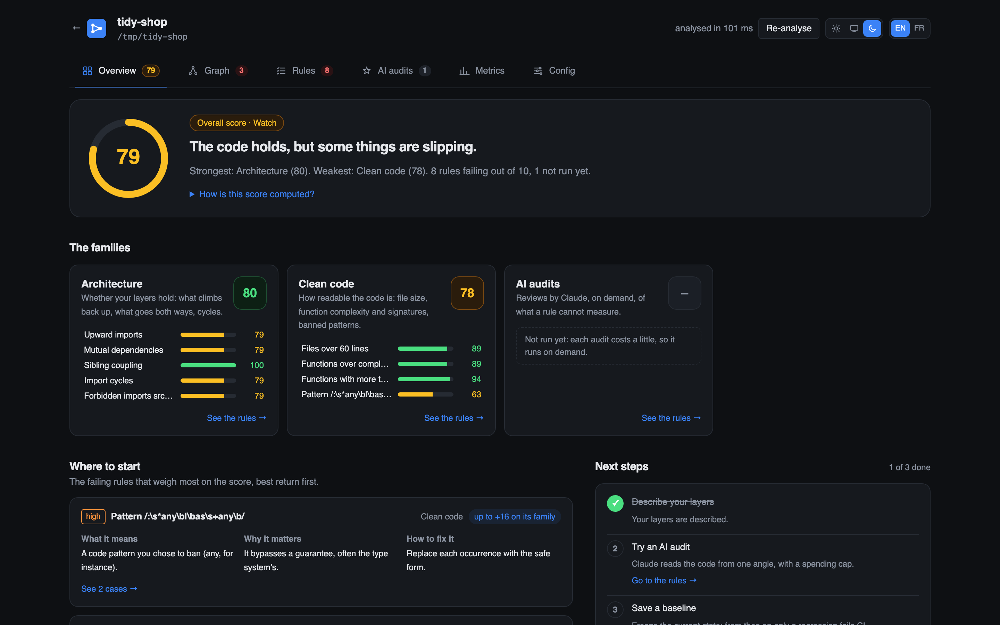
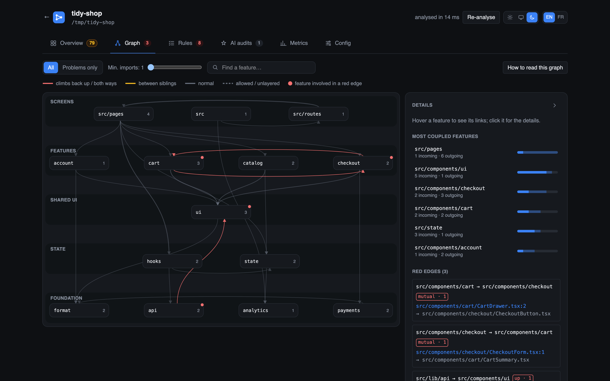
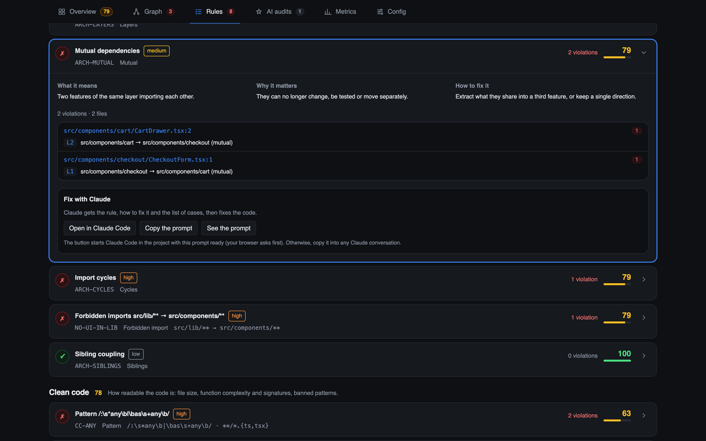
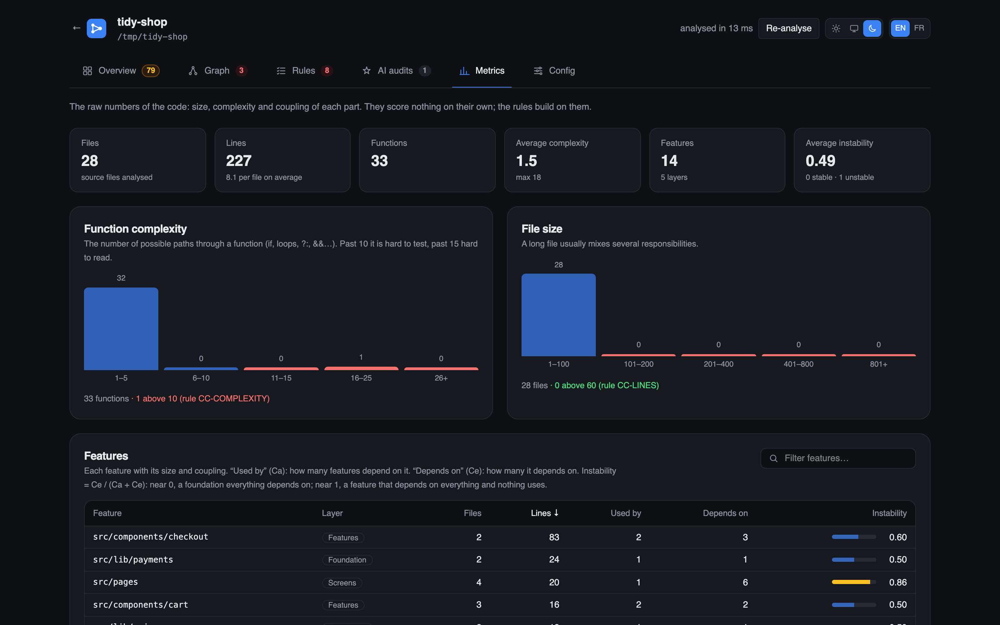

<div align="center">



**Map and audit a TypeScript codebase.**

The feature dependency graph across your layers, the metrics behind it, scripted and AI audit
rules, a score per family — and a CI guard that fails only when something got worse.

[](https://www.npmjs.com/package/@vincweb/code-atlas)
[](https://github.com/Vincweb/code-atlas/releases/latest)
[](https://github.com/Vincweb/code-atlas/actions/workflows/ci.yml)
[](package.json)
[](package.json)
[](LICENSE)

</div>

<br>

<div align="center">

</div>

<br>

```sh
npx @vincweb/code-atlas            # open the page on the current project
npx @vincweb/code-atlas --check    # fail CI on any regression against the baseline
```

## Why

Lint guards a line. Nothing guards the shape: which feature imports which, whether the layers you
drew on a whiteboard still hold, which corner of the code grows tangled. code-atlas reads the import
graph with your project's own TypeScript, groups files into features, places them in your layers,
and paints every dependency that climbs back up a layer or goes both ways between two features.

## Install

```sh
npx @vincweb/code-atlas               # run it once
npm install -D @vincweb/code-atlas    # or keep it in the project, for CI
```

Installed, the command is `code-atlas`. It serves `http://127.0.0.1:4800` and opens it in your browser — on the current folder when it is a
project, otherwise on a welcome screen with your recent projects and a folder browser. Node 20 or
newer and no runtime dependencies: it uses the `typescript` package the analyzed project already
has (TypeScript 7 ships no compiler API). Nothing leaves the machine, except what an AI rule sends
to Claude when you run one.

| Option              | Default                  | What it does                                      |
| ------------------- | ------------------------ | ------------------------------------------------- |
| `--root <dir>`      | the current folder       | the project to open                               |
| `--config <file>`   | `<root>/code-atlas.json` | another config file                               |
| `--state <dir>`     | `<root>/.code-atlas`     | where the baseline and the runs are kept          |
| `--port <n>`        | `4800`                   | the page's port                                   |
| `--host <host>`     | `127.0.0.1`              | the interface to listen on                        |
| `--no-open`         |                          | do not open the browser                           |
| `--check`           |                          | compare with the baseline, exit 1 on a regression |
| `--update-baseline` |                          | record the current state as the baseline          |
| `--skip-commands`   |                          | with the two above, leave the `command` rules out |

## The page

<div align="center">

</div>

- **Overview** — the overall score, a score per family (architecture, clean code, tooling, AI
  audits), the failing rules that weigh most, and the next steps.
- **Graph** — one band per layer, top to bottom. Red for a dependency that climbs a layer or goes
  both ways, amber for coupling between sibling features. Click a feature for its files, its
  coupling, and the import statements behind each red edge.
- **Rules** — every rule with its violations at `file:line`, what it means, why it matters and how
  to fix it. Command and AI rules run from here, their output streamed live.
- **AI audits** — what an AI rule does and the prompt it sends, a gallery of ready-made audits, and
  the findings of each run.
- **Metrics** — complexity and file-size distributions, each feature's size and instability, the
  most complex functions and the largest files.
- **Config** — the effective config explained section by section, or a draft to start from.

<div align="center">

</div>

<br>

<div align="center">

</div>

## Config

`code-atlas.json` at the project root. Without one, defaults apply and the Config tab drafts one
from the graph — layers by dependency depth — to write into the project and correct.

```json
{
  "$schema": "https://raw.githubusercontent.com/Vincweb/code-atlas/main/schema.json",
  "features": ["src/components/*", "src/lib/*", "src/*"],
  "layers": [
    { "name": "Entry", "features": ["src", "src/pages"] },
    { "name": "Features", "siblings": true, "features": ["src/components/*"] },
    { "name": "Core", "features": ["src/lib", "src/lib/*"] }
  ],
  "allow": [["src/lib/api", "src/lib/http"]],
  "rules": [
    { "id": "ARCH-LAYERS", "family": "architecture", "severity": "high", "kind": "layers" },
    {
      "id": "CC-COMPLEXITY",
      "family": "clean-code",
      "severity": "medium",
      "kind": "complexity",
      "max": 15
    },
    {
      "id": "TL-LINT",
      "family": "tooling",
      "severity": "high",
      "kind": "command",
      "run": "pnpm lint"
    },
    {
      "id": "AI-NAMING",
      "family": "ai",
      "severity": "medium",
      "kind": "ai",
      "prompt": "Review naming…"
    }
  ]
}
```

- **features** — ordered patterns; `*` binds one directory, first match wins.
- **layers** — top to bottom. A dependency may only go down; `siblings` forbids coupling inside one.
- **rules** — static kinds (`layers`, `mutual`, `siblings`, `no-cycle`, `forbid-import`,
  `max-lines`, `complexity`, `max-params`, `pattern`) are computed on every analysis; `command` and
  `ai` rules run on a click or under `--check`.

A rule scores `100 × 0.5^(violations / halfLife)`, its weight set by its severity; a family is the
weighted mean of its rules, the overall score the mean of the families.
[examples/tidy-shop](examples/tidy-shop) is a small fictitious project with a full config — the one
in the screenshots.

## AI rules

An `ai` rule runs Claude Code headless (`claude -p`) in the project, read-only (`Read`, `Grep`,
`Glob`), with a spending cap (`budgetUsd`, checked between turns, so a run can end a little over
it), and gets its findings back as structured data. It uses your own Claude Code login, or
`ANTHROPIC_API_KEY` when it is set: code-atlas never handles a key. Results are kept per rule and
marked stale when the commit moves. They never gate `--check`: two runs on the same commit can
disagree.

## Working with Claude Code

```sh
npx @vincweb/code-atlas describe
```

prints the config format and the project's current state — features, layers, red edges with the
imports behind them, rules, scores — written for an AI assistant. The page's "Open in Claude Code"
buttons open a new session in the Code tab of the Claude desktop app, on the project, with a prompt
that runs it before editing `code-atlas.json` or fixing a rule, and again to check the result; the
prompt is filled in, never sent. "Copy the prompt" does the same for any other assistant.

## CI

```sh
npx @vincweb/code-atlas --update-baseline   # once, and whenever you accept the current state
npx @vincweb/code-atlas --check             # fails when any rule has more violations than the baseline
```

The baseline lives in `.code-atlas/baseline.json` — commit it. Runs land in `.code-atlas/runs/`:
ignore that folder.

## Security

A `code-atlas.json` names commands to run, like a `package.json` names scripts: only open projects
you trust. Nothing runs when a page opens; running is a click, refused to any other origin. The
server answers only to `localhost` unless `--host` exposes it, and the page reads no dotfile,
nothing in `node_modules` and nothing outside the project — not even through a symlink.

## Development

```sh
pnpm install
pnpm dev --root ../some-project   # API on :4800 with reload, page on :4801
pnpm check                        # lint, types, tests, build
node scripts/readme-images.mjs    # regenerate docs/media from examples/tidy-shop (needs Chrome)
```

[docs/design.md](docs/design.md) records the decisions and the alternatives they beat.

## License

MIT
